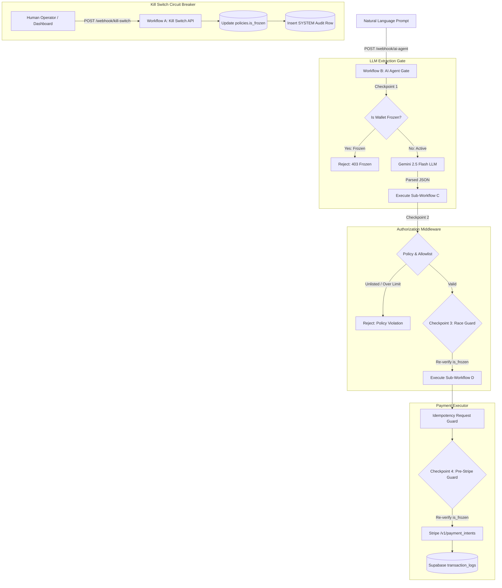

# 🛡️ THE KILL SWITCH — Independent AI Wallet Authorization Middleware

> **Zero-Trust Security, Multi-Stage Enforced Checkpoints, and Emergency Circuit Breakers for Autonomous Agentic Financial Transactions.**

[](https://paypilot-killswitch.vercel.app/)
[](https://opensource.org/licenses/MIT)
[](https://github.com/Abhijit5011/kill-switch)
[](https://n8n.io)
[](https://supabase.com)
[](https://stripe.com)

---

## 🚀 Live Production Deployment

🔗 **Live Website URL:** [https://paypilot-killswitch.vercel.app/](https://paypilot-killswitch.vercel.app/)

Experience **The Kill Switch** live in your browser, featuring single-URL gateway portal navigation, real-time n8n workflow execution node canvas visualizers, 3D circuit breaker emergency stops, and vendor invoice processing.

---

## 📖 Executive Summary

**The Kill Switch** is a zero-trust financial security middleware designed to enforce strict, auditable guardrails on autonomous AI payment agents. As AI agents gain autonomy to invoke APIs, execute contracts, and purchase goods, they introduce significant risks of financial loss due to prompt injection, hallucinated payment parameters, unlisted counterparties, or budget overflows.

**The Kill Switch** sits directly between the untrusted AI agent and payment rails (such as Stripe). It decouples LLM interpretation from financial execution, ensuring that **no AI agent ever possesses direct access to database credentials or Stripe API keys**. Every payment request passes through a 4-checkpoint security evaluation pipeline in **n8n**, backed by Supabase Postgres and a 3D physical Emergency Kill Switch capable of halting all autonomous transactions in under 50 milliseconds.

---

## 🌟 Key Application Features

### 1. 🌐 Single-URL Unified Deployment Gateway
- **Monochrome Entry Portal (`GatewayLandingScreen.jsx`):** On visiting the live URL, users land on an interactive entry gateway featuring 2 primary portals:
  - **`🚀 Launch AI Agent Client Portal`**: Client payment playground, real-time spend velocity tracking, and emergency stop controls.
  - **`🛡️ Access Vendor Invoice Server Portal`**: Enterprise vendor invoice processing, client PDF invoice generation, and audit logging.
- **Persistent Top Bar Switcher:** 1-click `⬅ Gateway Home` navigation allowing users to return to the main landing screen at any time.

### 2. 🤖 AI Agent Natural Language Playground & Gemini LLM Sandbox
- **Natural Language Payment Requests:** Submit agent prompts (e.g. *"Pay Acme Corp $150"* or *"Pay Unknown Target $500"*).
- **Gemini 2.5 Flash LLM Extraction:** Isolated natural language parser extracting structured JSON (`{ recipient, amount }`) without direct database or payment API access.

### 3. ⚡ n8n Live Workflow Node Execution Canvas
- **Visual Node Graph (`N8nPipelineVisualizer.jsx`):** Authentic n8n Cloud canvas visualizer displaying nodes (`🔴 Webhook`, `🟩 Supabase`, `🟧 Code/IF`, `🔷 Stripe`).
- **Animated SVG Bezier Cables:** Continuous glowing SVG bezier stream curves with real-time particle animation during active requests.
- **Granular Sub-Node Stepping:** Real-time execution pulses (`14ms`, `220ms`) showing passing checks (`✓`) or fail branches (`✕`).

### 4. 🛑 3D Hardware Circuit Breaker Kill Switch
- **Tactile 3D Housing (`KillSwitchControl.jsx`):** Features a flip-open protective cover and red emergency stop button.
- **< 50ms Emergency Freeze SLA:** Triggering STOP updates `policies.is_frozen = true` in Postgres in **under 50ms**.
- **Mandatory Operator Audit Log (`OperatorModal.jsx`):** Prompts for named operator signatures, recording immutable audit rows in Supabase.

### 5. 📊 Spend Velocity Tracking & Daily Caps
- **Real-Time Progress Bar (`SpendProgressBar.jsx`):** Visual spend cap bar and dynamic metric cards calculating remaining daily budget.
- **Interactive Counterparty Allowlist (`AddCompanyModal.jsx`):** Prominent `+ Add Company` modal allowing instant verification and Supabase persistence of approved merchants.

### 6. 📄 Enterprise Vendor Invoice & Server Portal
- **Corporate Invoice Operations (`VendorInvoicePortal.jsx`):** Manage vendor invoice states, verify approval signatures, and search invoice ledgers.
- **PDF Invoice Document Generation:** Instant browser-based PDF generation and direct receipt downloads.
- **Supabase Postgres Audit Ledger:** Real-time synchronized server logs.

---

## 🎯 Problem Statement & Zero-Trust Architecture

### The Problem
- **Direct Agent Exposure:** Giving an LLM direct access to payment APIs allows prompt injection attacks to drain corporate wallets.
- **Race Conditions:** Simultaneous agent requests can exceed daily caps if limits are checked once at the start of a request.
- **Lack of Accountability:** Machine-driven transactions lack human-auditable operator logs when emergency stops occur.

### The Zero-Trust Solution
- **Decoupled Architecture (ADR-001):** The AI Agent workflow interprets natural language into structured JSON, but possesses **zero database write permissions** and **zero Stripe API access**.
- **Sole Middleware Authority (ADR-002):** Authorization logic is completely isolated inside an immutable middleware workflow (**Workflow C**).
- **Atomic Pre-Execution Race Guard (ADR-003):** Policies are re-evaluated immediately before Stripe API calls are initiated (**Checkpoint 3 & Checkpoint 4**).
- **Auditable System Control (ADR-004):** Emergency stops require named operator signatures, recorded immutably in Supabase audit logs.

---

## 🏗️ End-to-End System Architecture



---

## 🏛️ Architectural Decision Records (ADRs)

| ADR ID | Title | Principle & Implementation |
| :--- | :--- | :--- |
| **ADR-001** | LLM Credential Isolation | Gemini 2.5 Flash key ONLY in Workflow B. 0 DB write permissions, 0 Stripe access. |
| **ADR-002** | Middleware Sole Authority | Workflow C holds Supabase Service Role key. Re-verifies all policies independently of LLM claims. |
| **ADR-003** | Multi-Stage Race Guard | Checkpoint 3 re-reads `policies.is_frozen` immediately prior to handing off to the payment executor. |
| **ADR-004** | Auditable Operator Actions | Kill switch activation requires explicit operator identification logged in Supabase `transaction_logs`. |
| **ADR-005** | Stripe Idempotency | Payment requests pass `request_id` header to Stripe `/v1/payment_intents` to prevent duplicate charges. |

---

## ⚙️ n8n Multi-Workflow Microservices Topology

The backend architecture consists of 4 decoupled n8n workflows (`n8n-workflows/*.json`):

1. **Workflow A — Kill Switch API (`workflow-a-kill-switch-api.json`):** Instantly mutates `policies.is_frozen` in Postgres (`true`/`false`) and appends an auditable `SYSTEM` transaction log row with the operator's name.
2. **Workflow B — AI Agent Gate (`workflow-b-ai-agent.json`):** Enforces **Checkpoint 1** (Fails fast if `policies.is_frozen === true` before calling Gemini) and converts prompt text into structured JSON.
3. **Workflow C — Authorization Middleware (`workflow-c-authorization-middleware.json`):** Enforces **Checkpoint 2** (Allowlist & daily spend cap validation) & **Checkpoint 3** (Pre-executor race guard).
4. **Workflow D — Payment Executor (`workflow-d-payment-executor.json`):** Enforces **Checkpoint 4** (Final pre-Stripe guard) and executes `/v1/payment_intents` on Stripe Test Rails.

---

## 🛠️ Technology Stack Breakdown

| Layer | Component / Technology | Purpose |
| :--- | :--- | :--- |
| **Frontend UI** | `React 18` + `Vite 5` + `TailwindCSS` | Component-based UI with glassmorphism and monochrome tokens. |
| **Animations** | `Framer Motion` + `Lucide Icons` | GPU-accelerated micro-animations and clean technical icon sets. |
| **Orchestration** | `n8n Cloud` | Multi-workflow microservices pipeline managing security logic. |
| **AI Intelligence** | `Gemini 2.5 Flash` | Isolated natural language prompt parsing in Workflow B. |
| **Database** | `Supabase Postgres` | High-availability PostgreSQL audit ledger and policy store. |
| **Payment Rail** | `Stripe API (Test Mode)` | Real test payment intents with idempotency header enforcement. |
| **Hosting** | `Vercel` | High-performance production deployment. |

---

## 📁 Repository Structure

```
kill-switch/
├── frontend/                               # Consolidated Single React/Vite Project
│   ├── index.html
│   ├── package.json
│   ├── vite.config.js
│   └── src/
│       ├── App.jsx                         # Main Router (Gateway / Client / Server Views)
│       ├── VendorInvoicePortal.jsx         # Consolidated Vendor Server Portal
│       ├── config.js                       # Environment & Webhook URL Configuration
│       └── components/
│           ├── GatewayLandingScreen.jsx     # Monochrome Gateway Landing Screen
│           ├── N8nPipelineVisualizer.jsx   # Live n8n Cloud Canvas Visualizer
│           ├── AddCompanyModal.jsx         # + Add Verified Counterparty Modal
│           ├── KillSwitchControl.jsx       # 3D Hardware Circuit Breaker Stop
│           ├── TransactionLedger.jsx       # Real-time Audit Log Ledger Table
│           ├── TransactionDetailDrawer.jsx # Glassmorphic Inspection Drawer
│           └── OperatorModal.jsx           # Operator Signature Audit Modal
├── n8n-workflows/                          # Exported n8n Workflow JSON Topologies
└── sql/                                    # Supabase Postgres Migration Scripts
```

---

## ⚡ Quick Start & Setup Guide

### 1. Clone & Install Dependencies
```bash
git clone https://github.com/Abhijit5011/kill-switch.git
cd kill-switch/frontend
npm install
```

### 2. Configure Environment Variables
Edit `frontend/src/config.js` to configure webhook endpoints and Supabase credentials:
```javascript
export const CONFIG = {
  AI_AGENT_WEBHOOK_URL: 'https://your-n8n-instance.com/webhook/ai-agent',
  KILL_SWITCH_WEBHOOK_URL: 'https://your-n8n-instance.com/webhook/kill-switch',
  SUPABASE_URL: 'https://your-supabase-id.supabase.co',
  SUPABASE_ANON_KEY: 'your-anon-key'
};
```

### 3. Launch Local Development
```bash
npm run dev
```
Open `http://localhost:3000` to access the **Unified Gateway Landing Screen**.

---

## 📄 License

Distributed under the **MIT License**. See `LICENSE` for details.
