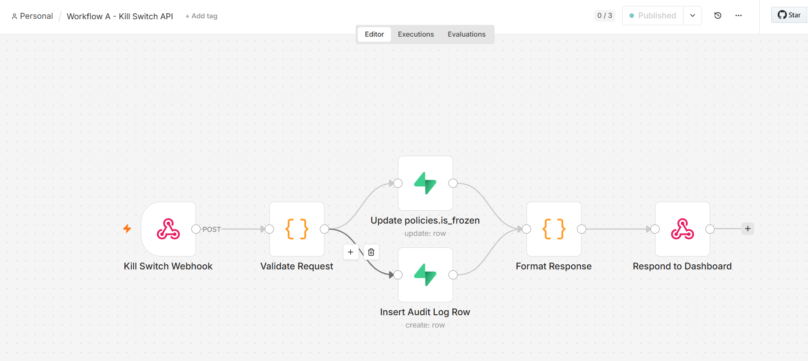
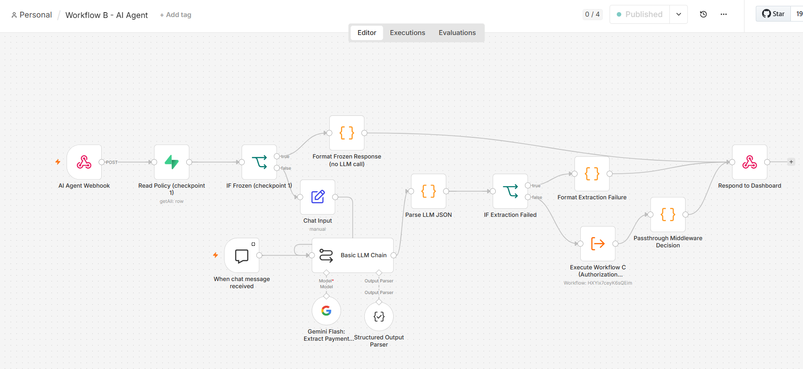
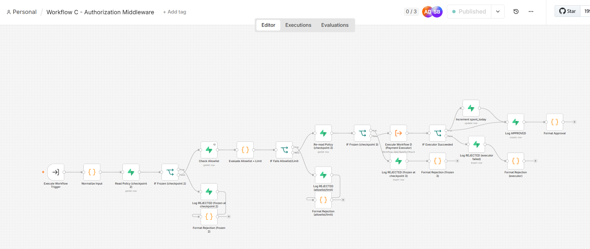
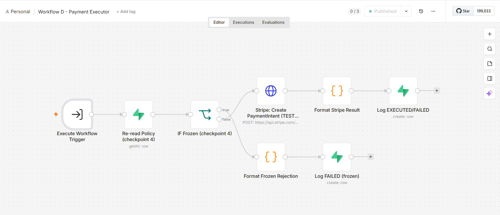
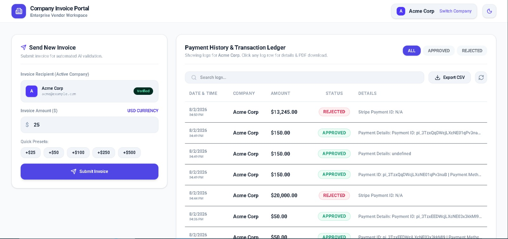
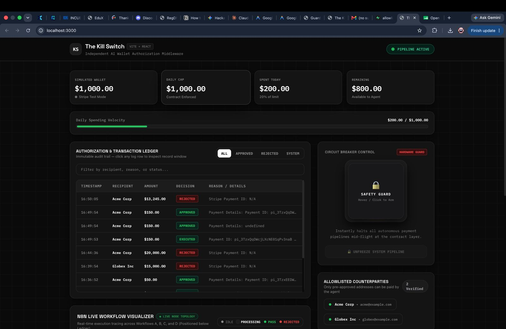
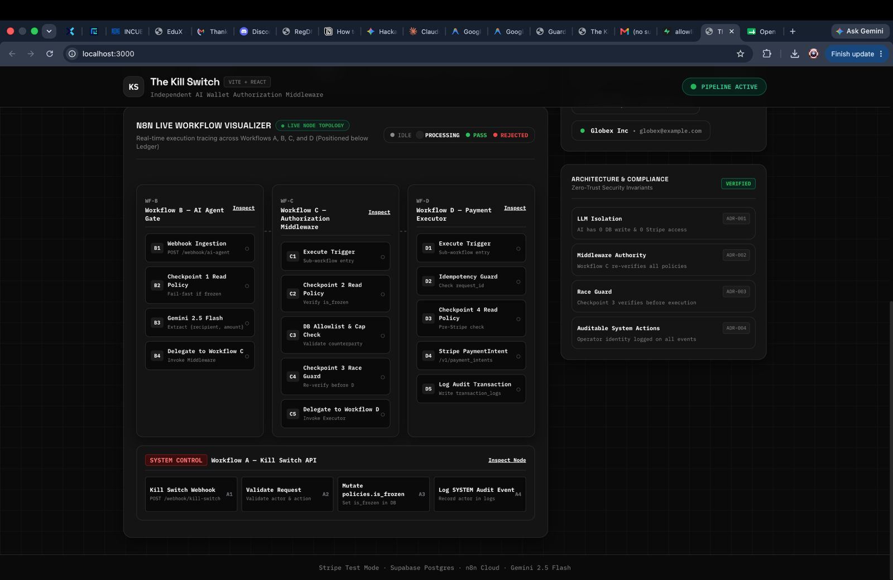
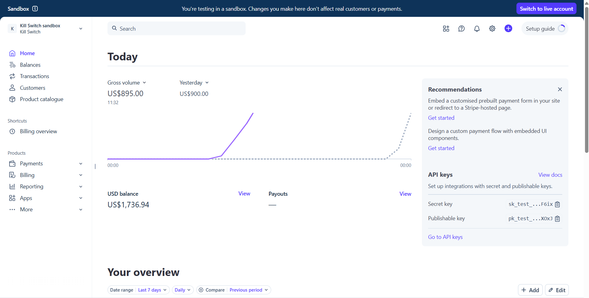
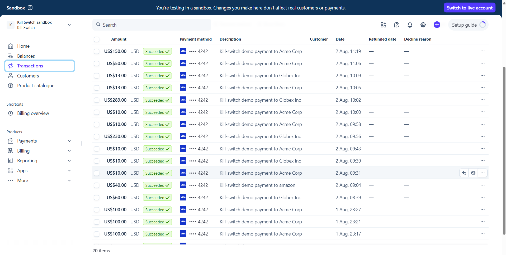

<div align="center">

# 🛡️ PayPilot
### AI-Powered, Zero-Trust Payment Authorization Middleware

*Secure. Intelligent. Auditable.*


</div>

## 🔗 Quick Links

- 🚀 **Live Deployed Link:** [https://your-deployment-link.vercel.app](https://paypilot-killswitch.vercel.app/)
- 🎥 **Demo Video:** https://drive.google.com/drive/folders/1hA-0RnG7-VepQRYmuCXBctR3cBdzkVrP?usp=sharing
- 📂 **GitHub Repository:** https://github.com/MeetRaval8983/PayPilot

---

## The problem

Letting an AI agent *initiate* a payment is easy. Letting it **authorize and
execute** one safely is the hard part — and it's the part most "agentic
payments" demos skip.

PayPilot is an independent authorization middleware that sits between an AI
agent and Stripe. The AI is only ever allowed to *read intent*. A separate,
deterministic middleware layer is the only thing that can say yes — and an
operator can kill the entire pipeline with one click, at any time.

---

## How it works — the four workflows

```
Company ERP → Client Dashboard → Workflow B (AI) → Workflow C (Authorize) → Workflow D (Execute) → Stripe + Audit Log
                                                                                      ↑
                                                              Workflow A (Kill Switch) ┘
```

### Workflow A — Kill Switch API
The emergency control. One webhook, one flag, propagated everywhere.

| Step | Node |
|---|---|
| 1 | `Kill Switch Webhook` — receives the freeze/unfreeze request |
| 2 | `Validate Request` — checks the actor and action |
| 3 | `Update policies.is_frozen` — flips the flag in the database |
| 4 | `Insert Audit Log Row` — records who did it and when |
| 5 | `Respond to Dashboard` |

**Checklist**
- [x] Actor identity verified before mutating policy
- [x] `is_frozen` flips atomically
- [x] Every freeze/unfreeze event is logged, no exceptions



---

### Workflow B — AI Agent Gate
The *only* place the AI touches the request — and it's read-only.

| Step | Node |
|---|---|
| 1 | `AI Agent Webhook` — ingests the incoming payment request |
| 2 | `Checkpoint 1` — read policy, fail fast if frozen |
| 3 | `Gemini 2.5 Flash` — extracts `{recipient, amount}` |
| 4 | `Parse LLM JSON` — validates the structured output |
| 5 | `Execute Workflow C` — delegates to the middleware |

**Checklist**
- [x] Frozen check happens *before* any LLM call
- [x] AI output is structured and validated, never trusted blindly
- [x] AI has **zero** DB write access and **zero** Stripe access



---

### Workflow C — Authorization Middleware
The real gatekeeper. Nothing reaches Stripe without clearing every gate here.

| Step | Node |
|---|---|
| 1 | `Normalize Input` |
| 2 | `Checkpoint 2` — re-read policy, reject if frozen |
| 3 | `Check Allowlist` — recipient must be pre-approved |
| 4 | `Evaluate Allowlist + Limit` — daily spending cap |
| 5 | `Checkpoint 3` — race guard, re-verify right before handoff |
| 6 | `Execute Workflow D` — delegates to the executor |
| 7 | `Log APPROVED` / `Log REJECTED` — with reason |

**Checklist**
- [x] Allowlist checked — no unknown counterparties
- [x] Daily cap enforced — no overspend
- [x] Idempotency check prevents duplicate charges
- [x] Race guard closes the timing gap before execution
- [x] Every decision, pass or fail, is logged



---

### Workflow D — Payment Executor
The only workflow with Stripe credentials.

| Step | Node |
|---|---|
| 1 | `Checkpoint 4` — final re-read of policy, fail fast if frozen |
| 2 | `Stripe: Create PaymentIntent` — test mode |
| 3 | `Format Stripe Result` |
| 4 | `Log EXECUTED / FAILED` — immutable audit row |

**Checklist**
- [x] Freeze re-checked immediately before the Stripe call
- [x] Only this workflow holds Stripe credentials
- [x] Success *and* failure both write a log row



---

## Dashboards

### Client Portal
Enterprise vendors submit invoices and watch them clear in real time.



### Admin Control Room
Wallet limits, spending velocity, allowlisted counterparties, and the
hardware-guarded circuit breaker — all in one place.



### Live Workflow Visualizer + Compliance
Real-time node execution tracing across all four workflows, next to the
zero-trust invariants they enforce.



### Stripe (Test Mode)
Every approved request becomes a real, traceable PaymentIntent.




---

## Zero-trust invariants

| Invariant | Enforced by |
|---|---|
| **LLM Isolation** — AI has 0 DB write & 0 Stripe access | Workflow B |
| **Middleware Authority** — every policy re-verified, every request | Workflow C |
| **Race Guard** — re-check immediately before execution | Checkpoints 3 & 4 |
| **Auditable System Actions** — every actor logged | All workflows |

---

## Tech stack

- **Frontend:** Vite + React (Client Dashboard, Admin Dashboard)
- **Automation / orchestration:** n8n Cloud
- **AI extraction:** Gemini 2.5 Flash
- **Payments:** Stripe (test mode)
- **Database / audit log:** Supabase Postgres

---

## Why it matters

Most "AI + payments" demos give the model too much rope. PayPilot's thesis is
simple: **the AI should never be the thing standing between a request and
your money.** A deterministic, independently-auditable middleware layer is —
and a human should always be able to shut the whole thing off in one click.
